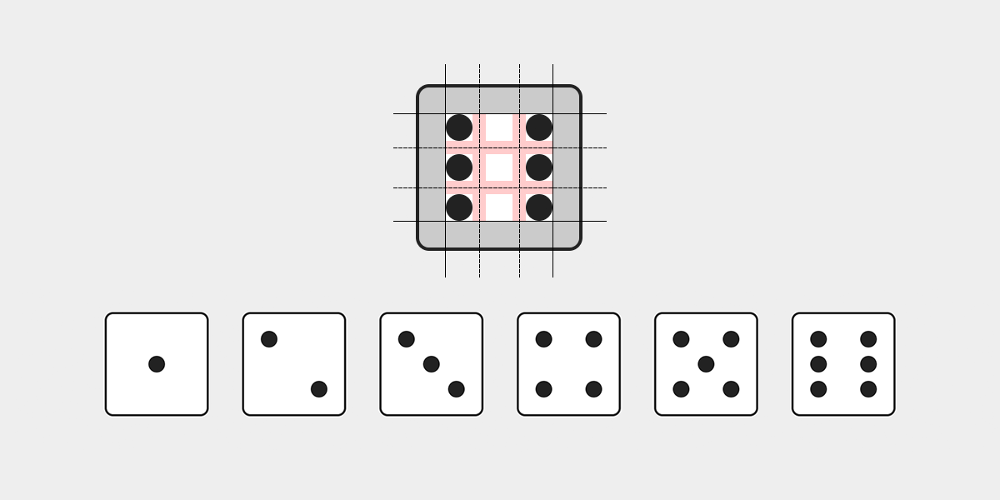
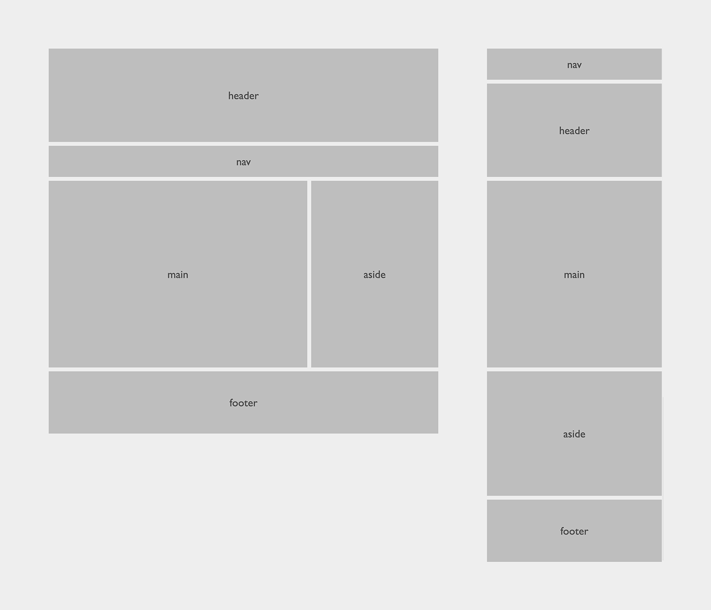
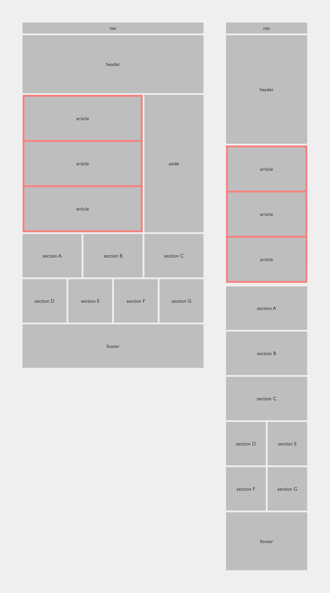
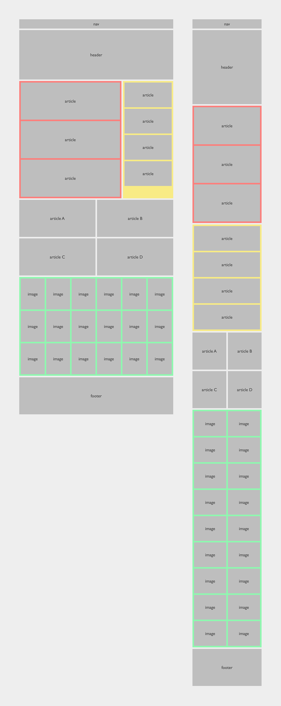

# CSS Grid Bootcamp

## Grid dices

Använd endast HTML och CSS med ett grid för att göra en tärnings 6 olika sidor.

Gridsystemet bör vara uppsatt enligt skissed nedan.

| Bokstav | teknik         |
| ------- | -------------- |
| **A**   | static         |
| **B**   | grid templates |



Förslag på html-struktur:

```html
<article class="dice dots-6">
  <aside></aside>
  <aside></aside>
  <aside></aside>
  <aside></aside>
  <aside></aside>
  <aside></aside>
</article>
```

## Samma layout, olika tekniker

**Static grid** kallas det när _grid-items_ placeras ut i grid-systemet med exakta positioner. Här använder man sig av grid-column-start, grid-column-end, grid-row-start och grid-row-end. Ex.

```css
.grid-item {
  grid-column: 3 / 4;
  grid-row: 1 / 2;
}
```

**Flow grid** kallas det när _grid-items_ placeras ut i grid-systemet efter ett flöde. Istället för att tala om _var_ grid-item ska ligga, så låter man dem följa gridflödet och istället ange dess storlek, dvs. de kolumner och rader som ska tas upp. Ex.

```css
.grid-item {
  grid-column: auto / span 2;
  grid-row: auto / span 1;
}
```

## 01. Golden layout

| Bokstav | teknik |
| ------- | ------ |
| **A**   | static |
| **B**   | flow   |



## 02. Dynamic layout

**Dynamic layout** är en grid-baserad layout som innehåller en _dynamisk yta_, d.v.s en yta som ska kunna växa / minska med innehållet i den.

De dynamiska ytorna visas med en _bakgrundsfärg_ i wireframen.

| Bokstav | teknik |
| ------- | ------ |
| **A**   | static |
| **B**   | flow   |



## 03. Complex Dynamic layout

**Complex dynamic layout** är en grid-baserad layout som innehåller flera _dynamiska ytor_, d.v.s ytor som ska kunna växa / minska med innehållet i dem.

De dynamiska ytorna visas med en _bakgrundsfärg_ i wireframen.

| Bokstav | teknik |
| ------- | ------ |
| **A**   | static |
| **B**   | flow   |


